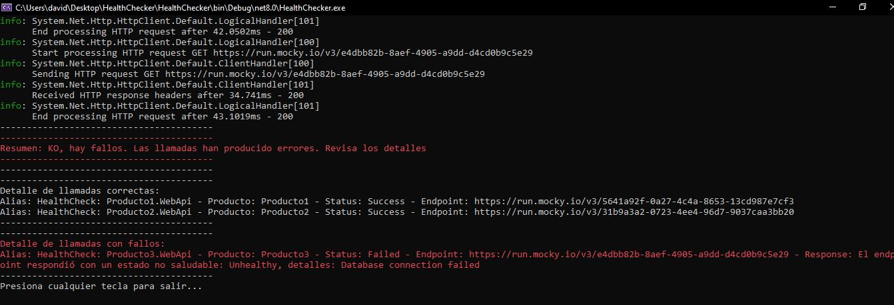

# HealthChecker

**HealthChecker** es una aplicación de consola que realiza verificaciones de salud en los endpoints especificados, imprime los resultados.
En un futuro está pensado para que pueda envíar un resumen por correo electrónico.

## Requisitos previos

- .NET 8.0 SDK o posterior.

## Configuración

### appsettings.json

Configura tus endpoints de verificación de salud en el archivo `appsettings.json` que desees testear.
Si inicialmente no tienes ninguno, los puedes crear con un producto de mocking de Urls temporales como [Mocky](https://designer.mocky.io/).

Por ejemplo, creando llamadas para una respuesta correcta:

```json
{
    "status": "Healthy"
}
```

O incorrecta:
```json
{
    "status": "Unhealthy",
    "details": "Database connection failed"
}
```

## Ejecutar la aplicación

1. Abre una terminal o símbolo del sistema.
2. Navega al directorio del proyecto.
3. Ejecuta la aplicación.

La aplicación realizará verificaciones de salud en los endpoints especificados, imprimirá los resultados en la consola y enviará un resumen por correo electrónico a la dirección configurada.

En caso de que el resultado no sea el esperado, se mostrará un mensaje como el siguiente:


# Cómo usar HealthChecker de manera automática

Se recomienda crear una tarea programada para Windows, con una de estas dos opciones:
- Ejecutar la aplicación cuando se inicie el sistema o la sesión. **Importante**: si usas esta opción, tendrás que tener acceso desde un inicio a la red o a los servicios que se están verificando.
- Ejecutar la aplicación todos los días a una hora específica.

## Configuración de una tarea programada:
Para ejecutar la aplicación todos los días a las 8:00 de la mañana, sigue estos pasos:

1. **Abrir el Programador de Tareas**:
   - Presiona `Win + R`, escribe `taskschd.msc` y presiona `Enter`.

2. **Crear una nueva tarea básica**:
   - En el panel derecho, selecciona "Crear tarea básica...".

3. **Configurar la tarea**:
   - **Nombre**: Asigna un nombre a la tarea, por ejemplo, " HealthChecker".
   - **Descripción**: Opcionalmente, puedes agregar una descripción, como "Ejecuta la aplicación HealthChecker diariamente".

4. **Desencadenador**:
   - Selecciona "Diariamente" y haz clic en "Siguiente".
   - Configura la hora a las 8:00 AM y haz clic en "Siguiente".

5. **Acción**:
   - Selecciona "Iniciar un programa" y haz clic en "Siguiente".
   - Haz clic en "Examinar..." y navega hasta el binario de tu aplicación (`HealthCheckTester.exe`) en `HealthCheckTester\bin\Debug\net8.0`. Selecciónalo y haz clic en "Abrir".

6. **Finalizar**:
   - Revisa la configuración y haz clic en "Finalizar".

## Ejecución, modificación, borrado de la tarea programada

### Ver los detalles de la tarea programada

Para ver los detalles de la tarea programada que has creado, puedes usar el siguiente comando en la línea de comandos:

`schtasks /query /tn "HealthChecker" /fo LIST /v`

### Ejecutar la tarea programada inmediatamente

Para ejecutar la tarea programada inmediatamente, usa el siguiente comando en la línea de comandos:

`schtasks /run /tn "HealthChecker"`

### Modificar la tarea programada

Para modificar una tarea programada, puedes usar el comando `schtasks /change`. Por ejemplo, para cambiar la hora de ejecución a las 9:00 AM, usa el siguiente comando:

`schtasks /change /tn "Ejecutar HealthChecker" /st 09:00`

### Borrar la tarea programada

Para borrar una tarea programada, usa el siguiente comando en la línea de comandos:

`schtasks /delete /tn "Ejecutar HealthChecker" /f`

## Licencia

Este proyecto está licenciado bajo la Licencia MIT.

## Control de versiones
| Versión | Fecha | Autor   | Observaciones |
| ------- | ------- | ------- | ------------- |
| 0.1     | 30/11/2024 | David S | Versión inicial   |